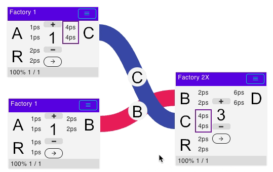
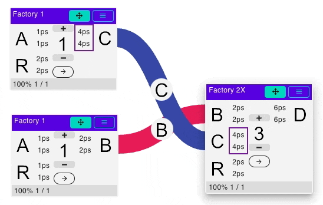
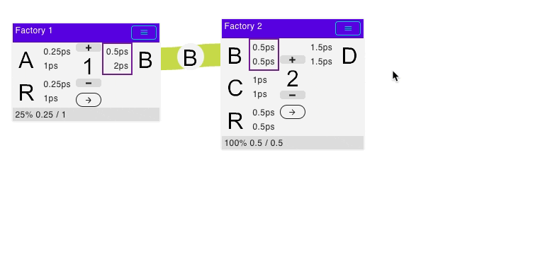
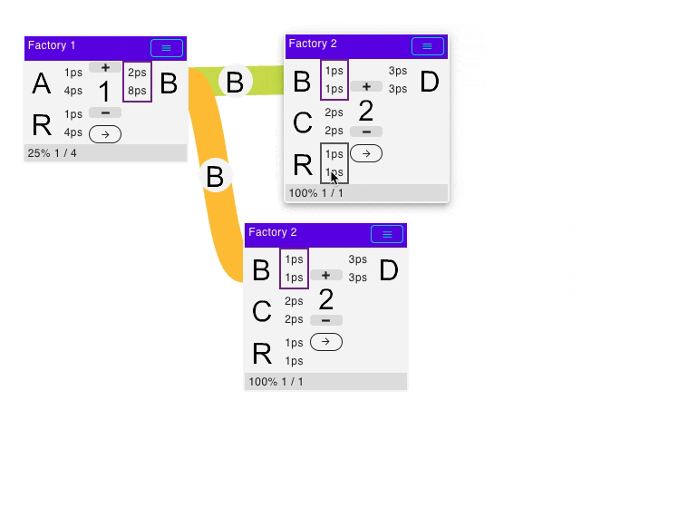
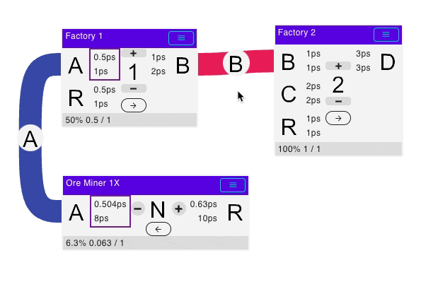
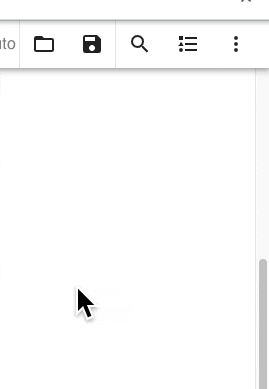
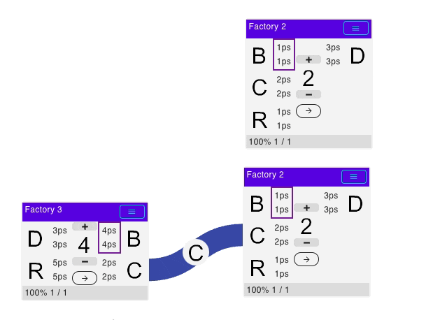
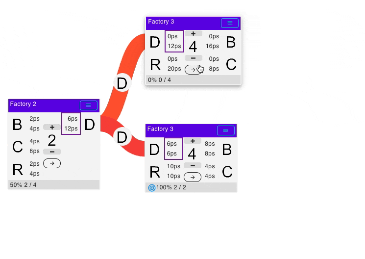

# daxfb-calculator
Calculator/Factory Planner for factory management games.

[Link to this page](https://doubleaxe.github.io/daxfb-calculator/docs/).

[Edit this page](https://github.com/doubleaxe/daxfb-calculator/edit/main/docs/README.md).

# General usage

Calculator can work in two modes: `Drag and Drop mode` and `Point and Click mode`.
First is optimized for PC usage and is turned on by default on PC.
Second is optimized (and default) for mobile devices, but also may be used on PC.
Modes are switched on and off using `Options` dialog.

## Drag and Drop mode

In this mode everything is dragged by primary mouse button.
Note: if both `Drag and Drop` and `Point and Click` modes are enabled,
there will be delay (300 ms) between mouse button is pressed on item and dragging actually starts.
This is done to differentiate `Click` and `Drag` events.

Drag factory and drop on blueprint

Drag links between factories

Drag link to change ports ordering

Drag to move factory

Drag on free space to scroll window

Drag something out of window to automatically scroll

## Point and Click mode

In this mode items can be selected with click, and then pasted/moved with another click on target element.

Paste factory on blueprint

Paste links between factories

Change port ordering (should click carefully on free space between ports)

Move factory

# Selecting  recipe

Just click on center factory icon to select recipe. Filters also work here.
If factory has only one recipe - recipes menu won't be shown.

Details

# Factory rotation

Factory may be rotated to create more pretty looking links.

See in action

# Factory count adjustment

Factory count can be set using `hamburger` factory menu. Optionally `Plus` and `Minus` button on factory card face can be turned on in settings. `Plus` and `Minus` adjust count by one, while textbox on menu can be used to set fractional counts. There is also `Mass Update Count` toolbar button, which could be used to apply automatically calculated counts.

See in action

# Factory upgrade / downgrade

If factory has next or previous tier version, upgrade option becomes available inside `hamburger` factory menu. Turning upgrade mode affects all factories.

See in action

# Inspection of logistic transport

Logistic transport can be inspected for links, which connects items with known transport (conveyors, pipes, manipulators, robotic arms). When clicking on link menu, logistic info will be shown automatically. Specific transport may be locked, in this case locked transport will be preferred for entire blueprint.

See in action

# Summary window

Summary window will show overall consumption / production / building costs of blueprint. Because it is calculated while blueprint is updated - it is recommended to turn it off for very large blueprints. Summary window can work in two modes - simple and expanded. Modes are switched sequentially by corresponding button. Summary window will be empty if blueprint is empty or not calculated. Summary window shows production / consumption only for open ends (not connected to anything).

See in action

# Filtering

Text filter accepts multiple words, these words are split by space and then applied to filter together.
For example search text `it a` may be used to search for `Item A`, or `co fu` may be used to search for `Copper Blast Furnace`.

## Filtering on left panel

Left panel factories may be filtered by input/output item.
If filter is applied - after adding new factory from left panel to blueprint corresponding recipe will be selected automatically.

## Filtering by input/output for factory on blueprint

Input/output adjacent square, which display throughput, may be clicked to quick filter left panel by matching item.
Because filtered recipe is selected automatically, this way long production lines may be built easier and quicker.

See in action

## Filtering on summary window

Filter can also be applied by clicking icon on summary window.

# Solving graph

Graph is solved by clicking on  toolbar button.
In automatic mode graph is solved automatically on every change.
Because solving is slower for larger factory count - manual mode is preferred for very large blueprints.

Solving is done with fixed precision, which can be changed in `Settings`.
The lower number means higher precision and better accuracy.
Because of this, there will be computation errors if connected factories throughput greatly differs or precision is too low.

## Automatic graph error detection

Factory chains may be unbalanced when factory outputs two item types, and these items directly or through production chain will be both feed to another factory at different rate. Production cycles may also be unbalanced. In this case graph solver cannot solve factory io, so entire flow rate will be 0. This is expected, because real production chain of this type will also produce at zero rate after some time, because one output will be clogged or input will be starved.

Graph solver has automatic error detection and will try to find port which causes error. This is implemented by adding virtual sink with lowest priority to each factory output. If this virtual sink flow is non-zero this means connected factory output is unbalanced, and such output will be highlighted in red color. To resolve this error, some building should be added instead of this virtual sink, which will consume overflown items.

Only unbalanced outputs are detected automatically, because it is most common case.

Example

## Special buildings

Almost every game implementation has set of special buildings. These buildings are usually represented as containers (maybe inexistent in real game) which accept all items of some kind (fluid, solid, etc). These buildings have 3 recipes, input, output and input+output. They could be used as utility buildings to tune production flows or for nicer graph layouts.

# Fine-tuning graph solve process

## Locking factories

Initially, if no factories in given line are locked, no input/output can go beyond maximum.
In this mode calculator will answer the question: where is bottleneck and how many items this line will produce.

When one or more factories are locked, other factories in the same line can go beyond their maximum count.
In this mode calculator will answer the question: how many factories will be needed to produce items at this rate.

See in action

## Setting objective

Initially graph is calculated using simple mode. In this mode graph solver tries to maximize overall io flow. This is acceptable for simple production chains, but may be adjusted for complex chains with multiple dependent output where maximizing one output will minimize other. It is recommended to set only one final product as main objective. Graph solver will first maximize main objective, and then will try to maximize secondary objective without hurting main objective. If any factory is set as objective - all other factories are excluded from maximization process.

See in action

# Known problems and limitations

## Too much flow difference between connected factories

When one factory produces/consumes at much higher ratio, than other connected factory (1000x or more), and their numbers are not integers, calculator fails to determine correct count due to insufficient precision. To fix this issue, precision should be set to other (lower) value, although it may not be enough for some cases.
