# Calculator/Factory Planner for factory management games

[Link to this page](https://doubleaxe.github.io/daxfb-calculator/).

# General usage

Calculator can work in two modes: `Drag and Drop mode` and `Point and Click mode`.
First can be used on PC only and will not work on touchscreen mobile devices.
Second is optimized for mobile devices, but may be used also on PC.
Modes may be switched on and off using `Options` dialog.

## Drag and Drop mode

In this mode everything is dragged by primary mouse button.
Note: if both `Drag and Drop` and `Point and Click` modes are enabled,
there will be delay between mouse button is pressed on item and dragging actually starts.
This is done to differentiate `Click` and `Drag` events.

Drag factory and drop on blueprint

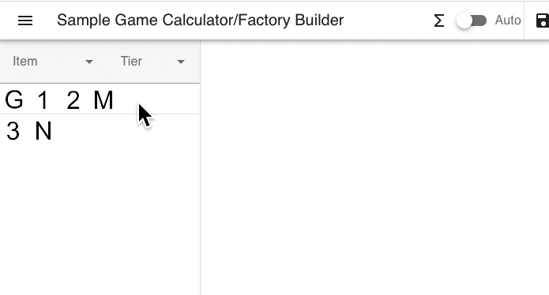

Drag links between factories

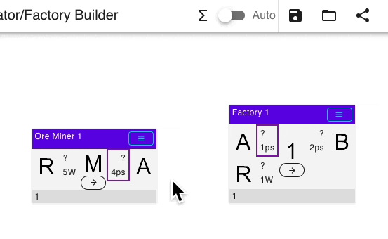

Drag to move factory

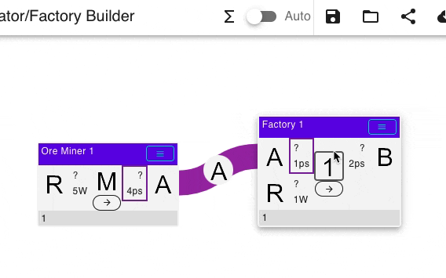

Drag on free space to scroll window

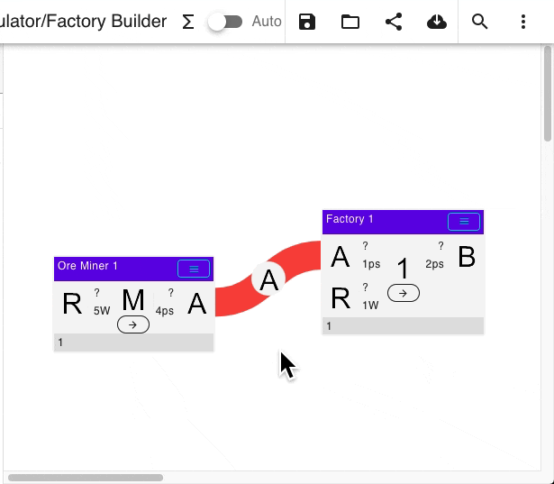

Drag something out of window to automatically scroll

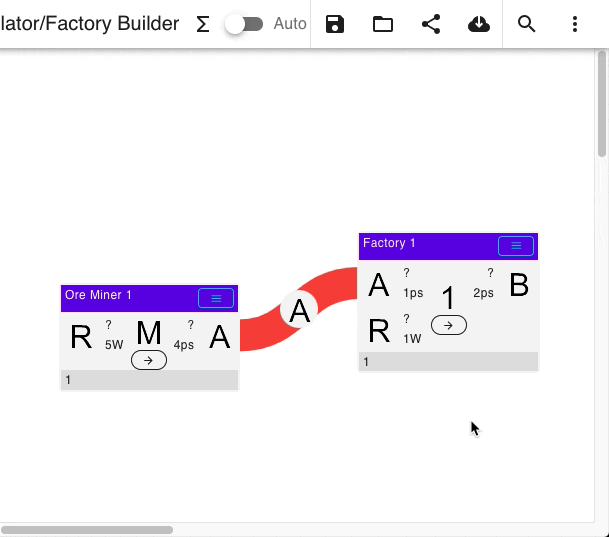

## Point and Click mode

In this mode items can be selected with click, and then pasted/moved with another click on target element.

Paste factory on blueprint

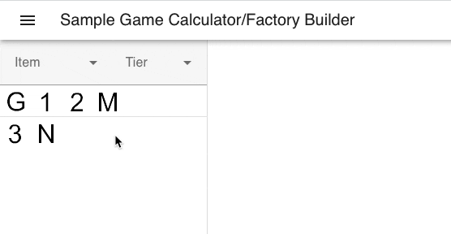

Paste links between factories

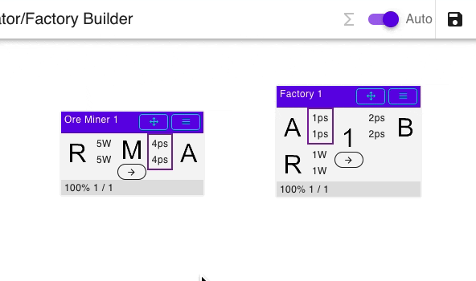

Move factory

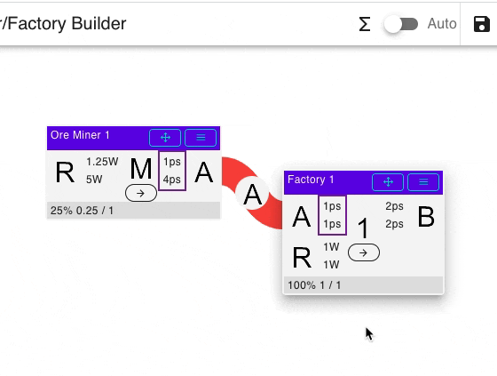

# Selecting  recipe

Just click on center factory icon to select recipe. Filters also work here.
If factory has only one recipe - recipes menu won't be shown.

Details

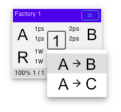

# Factory rotation

Factory may be rotated to create more pretty looking links.

See in action

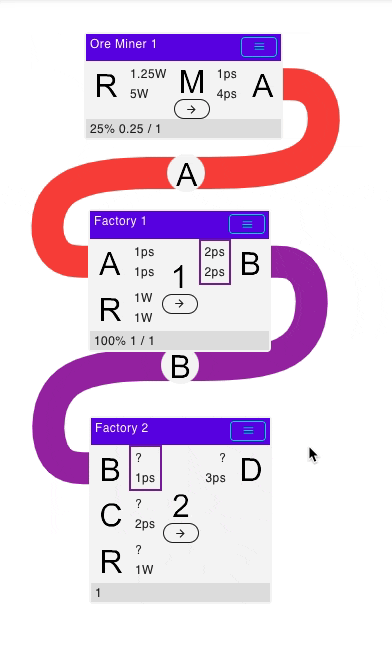

# Filtering

Text filter accepts multiple words, these words are split by space and then applied to filter together.
For example search text `it a` may be used to search for `Item A`, or `co fu` may be used to search for `Copper Blast Furnace`.

## Filtering on left panel

Left panel factories may be filtered by input/output item.
If filter is applied - after adding new factory from left panel to blueprint corresponding recipe will be selected automatically.

## Filtering by input/output for factory on blueprint

Input/output adjacent square, which display throughput, may be clicked to quick filter left panel by matching item.
Because filtered recipe is selected automatically, this way long production lines may be built easier and quicker.

See in action

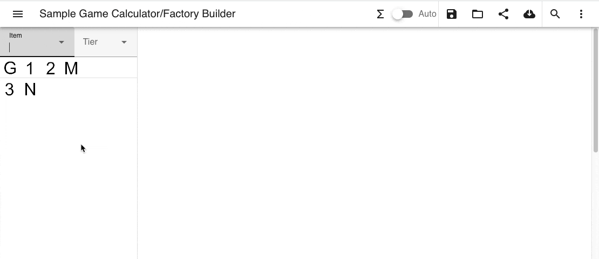

# Solving graph

Graph is solved by clicking on 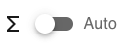 toolbar button.
In automatic mode graph is solved automatically on every change.
Because solving is slower for larger factory count - manual mode is preferred for very large blueprints.

Solving is done with fixed precision, which can be changed in `Settings`.
The lower number means higher precision and better accuracy.
Because of this, there will be computation errors if connected factories throughput greatly differs or precision is too low.

## Locking factories

Initially, if no factories in given line are locked, no input/output can go beyond maximum.
In this mode calculator will answer the question: where is bottleneck and how many items this line will produce.

When one or more factories are locked, other factories in the same line can go beyond their maximum count.
In this mode calculator will answer the question: how many factories will be needed to produce items at this rate.

See in action

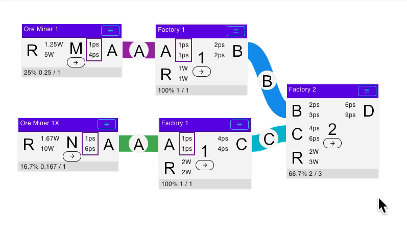

# Known problems and limitations

## Factory dual dependent io

When factory outputs two items or more, and these items directly or through production chain will be both feed to another factory at imperfect rate (i.e. first factory cannot dump all its output to second factory). In this case graph solver cannot solve factory io, so entire flow rate will be 0. This is not actually a bug, because real production chain of this type will also produce at zero rate after some time, because one output will be clogged. To overcome this, use two the same factories as input or output, or use 'fake' dump factory do dump exceeded resources.

Example

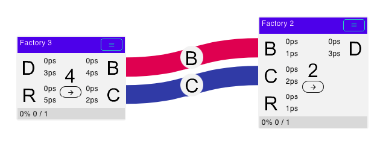
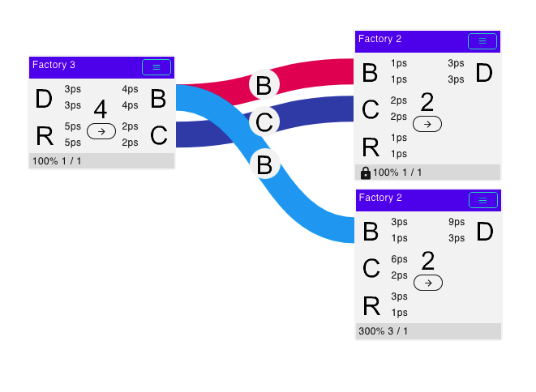

## Too much flow difference between connected factories

When one factory produces/consumes at much higher ratio, than other connected factory (1000x or more), and their numbers are not integers, calculator fails to determine correct count due to insufficient precision. To fix this issue, precision should be set to other (lower) value, although it may not be enough for some cases.
